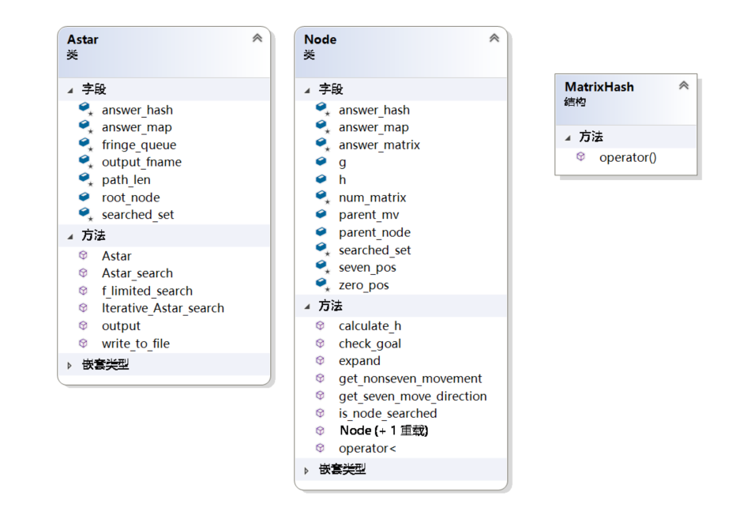
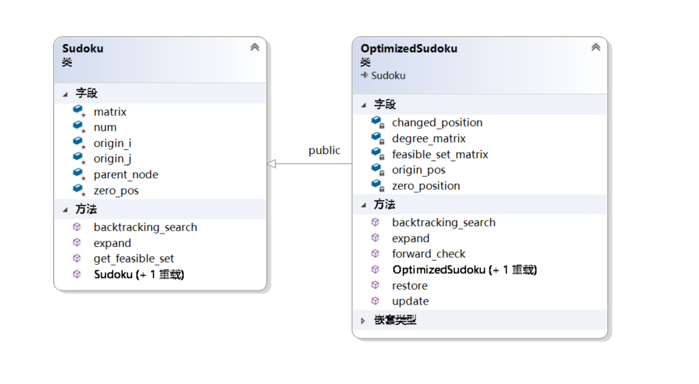

# AI 基础编程作业：A* & CSP

### 李喆昊 PB17050941


## 目录

1. 数码问题
   1. 启发式函数的选择
   2. 算法设计与优化方法
   3. 结果分析
2. X数独问题
   1. 算法设计与优化方法
   2. 结果分析
   3. 思考题
3. 代码编译运行方式
4. 总结反思


## 一. 数码问题

1. **启发式函数的选择**

   使用的是$3\times($每个数码块当前位置到其目标位置的曼哈顿距离$)$。

   因为该启发式函数是真实移动数码块代价的一个松弛，所以该启发式函数是可采纳的。

   

2. **算法设计与优化方法**

   1. 设计了两个类`Node` 与`Astar`。类图如下：

      

      A* 算法将使用 Astar 类的 `Astar_search`函数，迭代A*算法将使用 Astar 类的`Iterative_Astar_search` 与 `f_limited_search` 函数。

      

   2. 如何选取$f$值最小的结点

      使用优先队列。通过定义`operator<`， 在`fringe_queue.top()`位置的结点就是 $f$值最小的结点。在`Astar_search`函数与`f_limited_search`函数内部都维护了这个队列。

      

   3. A* 算法中对重复结点的判断方法

      在Astar类内部，使用了数据结构`unorder_set`存储已经访问过的结点的数字矩阵状态，通过hash实现了$O(1)$的检查时间。

      

   4. A*每次迭代数码块的移动方法

      在Node类的`expand`函数内调用了`get_nonseven_movement`函数与`get_seven_move_direction`函数去获取可行的移动方式，并组装新结点，返回`vector<Node*>`.

      

3. **结果分析**

   | 测试数据 | A*所用时间(s) | A*迭代次数 | A*结果步数 | IDA*所用时间(s) | IDA*迭代次数 | IDA*结果步数 |
   | -------- | ------------- | ---------- | ---------- | --------------- | ------------ | ------------ |
   | 1        | 0.299864      | 14303      | 25         | 0.30101         | 14303        | 25           |
   | 2        | 0.0406674     | 579        | 13         | 0.0714659       | 3206         | 13           |
   | 3        | \             | \          | \          | \               | \            | \            |

   (测试样例3因为测试时间不够没有得出结果)
   
   算法时间复杂度分析：A* : $O(d^n)$, IDAstar : $O(nd^n)$ （设迭代n轮，每个结点平均扩展d个结点）
   
   空间复杂度分析： 因为IDAstar能够在有解的情况下找到最浅层的解，所以其平均空间复杂度优于A*。
   
   

## 二. X数独问题

1. **算法设计与优化方法**

   1. 设计了两个类``Sudoku``与``OptimizedSudoku``分别进行未优化/优化后的CSP回溯算法。类图如下。
   

      

   2. 优化方法

      + 通过使用全局变量与指针减少拷贝开销。

        所有结点共享九宫格矩阵，在每次深度优先搜索的迭代中，选定结点后才对共享的九宫格进行更新，而在生成扩展结点时不更新。需要注意的是，因为维护了一个全局的九宫格矩阵数组，因此在当前路径无法继续探索下去进行回退时，需要将全局九宫格矩阵回复到原来的状态。

        

      + 采用了度启发式选择合适的拓展结点

        这里我采用的度启发式是九宫格中每一个还未填上数字处可选择的可行数字的数量。通过在OptimizedSudoku内维护了一个记录度数的`degree_matrix`与记录可行数字的`feasible_set_matrix`实现对度启发式的动态更新与常数阶时间查找。

        
   
      + 使用前向检验进行剪枝
   
        前向检验的具体操作过程是：在扩展结点时，检查九宫格中所有还未填上数字处其度启发式是否已经为0。为0说明之后不可能在这个位置填上数字，因此没有继续沿着这一条错误路径探索的必要。
   
      
   
2. **结果分析**

   | 测试数据 | 未优化的时间(s) | 未优化搜索节点数 | 使用度启发式+前向检验(s) | 使用度启发式+前向检验搜索节点数 |
   | -------- | --------------- | ---------------- | ------------------------ | ------------------------------- |
   | 1        | 0.035174        | 251              | 0.0399357                | 47                              |
   | 2        | 0.0342854       | 1532             | 0.0319547                | 77                              |
   | 3        | 0.0724551       | 121177           | 0.0333246                | 853                             |

   

3. **思考题**

   + 使用爬山算法的解决思路：

     每次选择使得总度启发式减少最多的结点进行扩展。可能的问题：当前最优不一定是全局最优

   + 使用模拟退火算法的解决思路：

     每次选择使得总度启发式减少较多的结点进行扩展，但是允许选择的结点使得总度启发式增加。可能的问题：允许总度启发式增加的阈值难以确定。

   + 使用遗传算法的解决思路：

     对九宫格随机赋值填满，每次交换数组中的一些值，使得一些约束被满足，优化的目标是减少九宫格中冲突数。可能的问题：效率不高。

   

## 三. 代码编译运行方式

编译方式：使用cmake对项目进行configure、generate，然后build.

命令行运行方式：(以.exe为例)

```shell
usage: Astar.exe <input file path> <answer file path> <output file path> <0 or 1(A*: 0, IDA*:1), default: 0>
```

```shell
usage: sudoku.exe <input file path> <output file path> <optimized:0 non-optimized: 1. default: optimized>
```


## 四. 总结反思

	1. 总结：通过本次作业增加了对C++的掌握与OOP思想的理解，并增加了对性能优化的兴趣
 	2. 反思：
     + 低估了作业的难度，开始时间较迟，导致第一题测试样例3没有得到结果。
     + 对C++的内存管理掌握不牢，程序中存在可能的内存泄漏，需要使用智能指针。