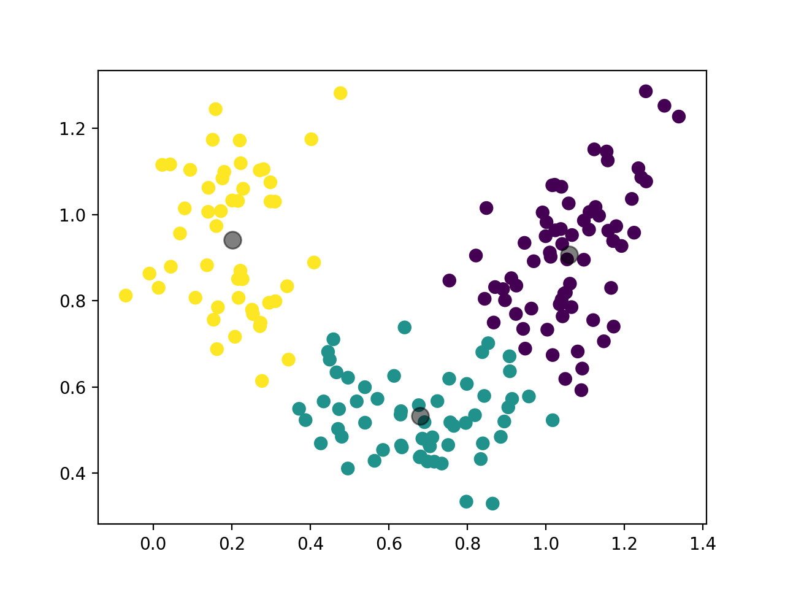
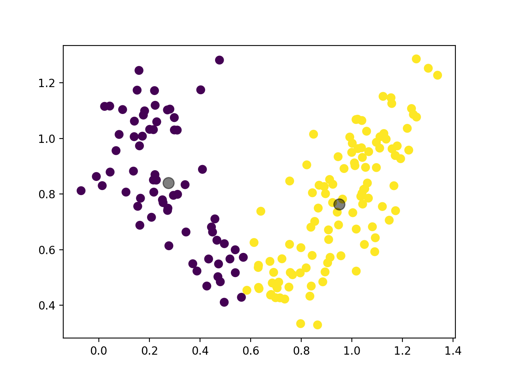

# KNN
## use G1, G2, G3 
============= data file: data/student/student-mat.csv =============
train data size: 276, test data size: 119
======= KNN: K = 9 ====== 
TP: 66, FP: 0, TN: 0, FN: 0
F1 score: 1.0, Precision: 1.0, Recall: 1.0
time used: 0.0033729999999998483
============= data file: data/student/student-por.csv =============
train data size: 454, test data size: 195
======= KNN: K = 9 ====== 
TP: 156, FP: 2, TN: 0, FN: 0
F1 score: 0.9936305732484078, Precision: 0.9873417721518988, Recall: 1.0
time used: 0.006742000000000026

# SVM
## 1 rbf C=200 gamma = 1
============= data file: data/student/student-mat.csv, feature: Index(['school', 'sex', 'age', 'address', 'famsize', 'Pstatus', 'Medu', 'Fedu',
       'Mjob', 'Fjob', 'reason', 'guardian', 'traveltime', 'studytime',
       'failures', 'schoolsup', 'famsup', 'paid', 'activities', 'nursery',
       'higher', 'internet', 'romantic', 'famrel', 'freetime', 'goout', 'Dalc',
       'Walc', 'health', 'absences', 'G3'],
      dtype='object') =============
train data size: 276, test data size: 119
======= SVM: C = 200, gamma = 1, kernel type: rbf ====== 
======= SVM: C = 200, gamma = 1, kernel type: rbf ====== 
======= SVM: C = 200, gamma = 1, kernel type: rbf ====== 
======= SVM: C = 200, gamma = 1, kernel type: rbf ====== 
======= SVM: C = 200, gamma = 1, kernel type: rbf ====== 
Average F1 score: 0.5909090909090908, Precision: 0.65, Recall: 0.5416666666666666

============= data file: data/student/student-por.csv, feature: Index(['school', 'sex', 'age', 'address', 'famsize', 'Pstatus', 'Medu', 'Fedu',
       'Mjob', 'Fjob', 'reason', 'guardian', 'traveltime', 'studytime',
       'failures', 'schoolsup', 'famsup', 'paid', 'activities', 'nursery',
       'higher', 'internet', 'romantic', 'famrel', 'freetime', 'goout', 'Dalc',
       'Walc', 'health', 'absences', 'G3'],
      dtype='object') =============
train data size: 454, test data size: 195
======= SVM: C = 200, gamma = 1, kernel type: rbf ====== 
======= SVM: C = 200, gamma = 1, kernel type: rbf ====== 
======= SVM: C = 200, gamma = 1, kernel type: rbf ====== 
======= SVM: C = 200, gamma = 1, kernel type: rbf ====== 
======= SVM: C = 200, gamma = 1, kernel type: rbf ====== 
Average F1 score: 0.48034934497816606, Precision: 0.9649122807017545, Recall: 0.31976744186046513

## 2 rbf C=200 gamma = 0.1
============= data file: data/student/student-mat.csv, feature: Index(['school', 'sex', 'age', 'address', 'famsize', 'Pstatus', 'Medu', 'Fedu',
       'Mjob', 'Fjob', 'reason', 'guardian', 'traveltime', 'studytime',
       'failures', 'schoolsup', 'famsup', 'paid', 'activities', 'nursery',
       'higher', 'internet', 'romantic', 'famrel', 'freetime', 'goout', 'Dalc',
       'Walc', 'health', 'absences', 'G3'],
      dtype='object') =============
train data size: 276, test data size: 119
======= SVM: C = 200, gamma = 0.1, kernel type: rbf ====== 
======= SVM: C = 200, gamma = 0.1, kernel type: rbf ====== 
======= SVM: C = 200, gamma = 0.1, kernel type: rbf ====== 
======= SVM: C = 200, gamma = 0.1, kernel type: rbf ====== 
======= SVM: C = 200, gamma = 0.1, kernel type: rbf ====== 
======= SVM: C = 200, gamma = 0.1, kernel type: rbf ====== 
======= SVM: C = 200, gamma = 0.1, kernel type: rbf ====== 
======= SVM: C = 200, gamma = 0.1, kernel type: rbf ====== 
======= SVM: C = 200, gamma = 0.1, kernel type: rbf ====== 
======= SVM: C = 200, gamma = 0.1, kernel type: rbf ====== 
Average F1 score: 0.6363636363636365, Precision: 0.7241379310344829, Recall: 0.5675675675675675

============= data file: data/student/student-por.csv, feature: Index(['school', 'sex', 'age', 'address', 'famsize', 'Pstatus', 'Medu', 'Fedu',
       'Mjob', 'Fjob', 'reason', 'guardian', 'traveltime', 'studytime',
       'failures', 'schoolsup', 'famsup', 'paid', 'activities', 'nursery',
       'higher', 'internet', 'romantic', 'famrel', 'freetime', 'goout', 'Dalc',
       'Walc', 'health', 'absences', 'G3'],
      dtype='object') =============
train data size: 454, test data size: 195
======= SVM: C = 200, gamma = 0.1, kernel type: rbf ====== 
======= SVM: C = 200, gamma = 0.1, kernel type: rbf ====== 
======= SVM: C = 200, gamma = 0.1, kernel type: rbf ====== 
======= SVM: C = 200, gamma = 0.1, kernel type: rbf ====== 
======= SVM: C = 200, gamma = 0.1, kernel type: rbf ====== 
======= SVM: C = 200, gamma = 0.1, kernel type: rbf ====== 
======= SVM: C = 200, gamma = 0.1, kernel type: rbf ====== 
======= SVM: C = 200, gamma = 0.1, kernel type: rbf ====== 
======= SVM: C = 200, gamma = 0.1, kernel type: rbf ====== 
======= SVM: C = 200, gamma = 0.1, kernel type: rbf ====== 
Average F1 score: 0.8438538205980066, Precision: 0.9338235294117647, Recall: 0.7696969696969697

## 3 rbf C=200 gamma = 0.01
============= data file: data/student/student-mat.csv, feature: Index(['school', 'sex', 'age', 'address', 'famsize', 'Pstatus', 'Medu', 'Fedu',
       'Mjob', 'Fjob', 'reason', 'guardian', 'traveltime', 'studytime',
       'failures', 'schoolsup', 'famsup', 'paid', 'activities', 'nursery',
       'higher', 'internet', 'romantic', 'famrel', 'freetime', 'goout', 'Dalc',
       'Walc', 'health', 'absences', 'G3'],
      dtype='object') =============
train data size: 276, test data size: 119
======= SVM: C = 200, gamma = 0.01, kernel type: rbf ====== 
======= SVM: C = 200, gamma = 0.01, kernel type: rbf ====== 
======= SVM: C = 200, gamma = 0.01, kernel type: rbf ====== 
======= SVM: C = 200, gamma = 0.01, kernel type: rbf ====== 
======= SVM: C = 200, gamma = 0.01, kernel type: rbf ====== 
======= SVM: C = 200, gamma = 0.01, kernel type: rbf ====== 
======= SVM: C = 200, gamma = 0.01, kernel type: rbf ====== 
======= SVM: C = 200, gamma = 0.01, kernel type: rbf ====== 
======= SVM: C = 200, gamma = 0.01, kernel type: rbf ====== 
======= SVM: C = 200, gamma = 0.01, kernel type: rbf ====== 
Average F1 score: 0.6239999999999999, Precision: 0.78, Recall: 0.5199999999999999

============= data file: data/student/student-por.csv, feature: Index(['school', 'sex', 'age', 'address', 'famsize', 'Pstatus', 'Medu', 'Fedu',
       'Mjob', 'Fjob', 'reason', 'guardian', 'traveltime', 'studytime',
       'failures', 'schoolsup', 'famsup', 'paid', 'activities', 'nursery',
       'higher', 'internet', 'romantic', 'famrel', 'freetime', 'goout', 'Dalc',
       'Walc', 'health', 'absences', 'G3'],
      dtype='object') =============
train data size: 454, test data size: 195
======= SVM: C = 200, gamma = 0.01, kernel type: rbf ====== 
======= SVM: C = 200, gamma = 0.01, kernel type: rbf ====== 
======= SVM: C = 200, gamma = 0.01, kernel type: rbf ====== 
======= SVM: C = 200, gamma = 0.01, kernel type: rbf ====== 
======= SVM: C = 200, gamma = 0.01, kernel type: rbf ====== 
======= SVM: C = 200, gamma = 0.01, kernel type: rbf ====== 
======= SVM: C = 200, gamma = 0.01, kernel type: rbf ====== 
======= SVM: C = 200, gamma = 0.01, kernel type: rbf ====== 
======= SVM: C = 200, gamma = 0.01, kernel type: rbf ====== 
======= SVM: C = 200, gamma = 0.01, kernel type: rbf ====== 
Average F1 score: 0.931129476584022, Precision: 0.8756476683937823, Recall: 0.9941176470588236

## 4 linear C=200 
============= data file: data/student/student-mat.csv, feature: Index(['school', 'sex', 'age', 'address', 'famsize', 'Pstatus', 'Medu', 'Fedu',
       'Mjob', 'Fjob', 'reason', 'guardian', 'traveltime', 'studytime',
       'failures', 'schoolsup', 'famsup', 'paid', 'activities', 'nursery',
       'higher', 'internet', 'romantic', 'famrel', 'freetime', 'goout', 'Dalc',
       'Walc', 'health', 'absences', 'G3'],
      dtype='object') =============
train data size: 276, test data size: 119
======= SVM: C = 200, gamma = 0.01, kernel type: linear ====== 
======= SVM: C = 200, gamma = 0.01, kernel type: linear ====== 
======= SVM: C = 200, gamma = 0.01, kernel type: linear ====== 
======= SVM: C = 200, gamma = 0.01, kernel type: linear ====== 
======= SVM: C = 200, gamma = 0.01, kernel type: linear ====== 
======= SVM: C = 200, gamma = 0.01, kernel type: linear ====== 
======= SVM: C = 200, gamma = 0.01, kernel type: linear ====== 
======= SVM: C = 200, gamma = 0.01, kernel type: linear ====== 
======= SVM: C = 200, gamma = 0.01, kernel type: linear ====== 
======= SVM: C = 200, gamma = 0.01, kernel type: linear ====== 
Average F1 score: 0.8393782383419689, Precision: 0.7864077669902912, Recall: 0.9

============= data file: data/student/student-por.csv, feature: Index(['school', 'sex', 'age', 'address', 'famsize', 'Pstatus', 'Medu', 'Fedu',
       'Mjob', 'Fjob', 'reason', 'guardian', 'traveltime', 'studytime',
       'failures', 'schoolsup', 'famsup', 'paid', 'activities', 'nursery',
       'higher', 'internet', 'romantic', 'famrel', 'freetime', 'goout', 'Dalc',
       'Walc', 'health', 'absences', 'G3'],
      dtype='object') =============
train data size: 454, test data size: 195
======= SVM: C = 200, gamma = 0.01, kernel type: linear ====== 
======= SVM: C = 200, gamma = 0.01, kernel type: linear ====== 
======= SVM: C = 200, gamma = 0.01, kernel type: linear ====== 
======= SVM: C = 200, gamma = 0.01, kernel type: linear ====== 
======= SVM: C = 200, gamma = 0.01, kernel type: linear ====== 
======= SVM: C = 200, gamma = 0.01, kernel type: linear ====== 
======= SVM: C = 200, gamma = 0.01, kernel type: linear ====== 
======= SVM: C = 200, gamma = 0.01, kernel type: linear ====== 
======= SVM: C = 200, gamma = 0.01, kernel type: linear ====== 
======= SVM: C = 200, gamma = 0.01, kernel type: linear ====== 
Average F1 score: 0.7902097902097902, Precision: 0.9416666666666667, Recall: 0.6807228915662652

## 5 linear
============= data file: data/student/student-mat.csv, feature: Index(['G1', 'G2', 'G3'], dtype='object') =============
train data size: 276, test data size: 119
======= SVM: C = 200, gamma = 0.01, kernel type: linear ====== 
======= SVM: C = 200, gamma = 0.01, kernel type: linear ====== 
======= SVM: C = 200, gamma = 0.01, kernel type: linear ====== 
======= SVM: C = 200, gamma = 0.01, kernel type: linear ====== 
======= SVM: C = 200, gamma = 0.01, kernel type: linear ====== 
======= SVM: C = 200, gamma = 0.01, kernel type: linear ====== 
======= SVM: C = 200, gamma = 0.01, kernel type: linear ====== 
======= SVM: C = 200, gamma = 0.01, kernel type: linear ====== 
======= SVM: C = 200, gamma = 0.01, kernel type: linear ====== 
======= SVM: C = 200, gamma = 0.01, kernel type: linear ====== 
Average F1 score: 0.8950276243093922, Precision: 0.8100000000000002, Recall: 1.0

============= data file: data/student/student-por.csv, feature: Index(['G1', 'G2', 'G3'], dtype='object') =============
train data size: 454, test data size: 195
======= SVM: C = 200, gamma = 0.01, kernel type: linear ====== 
======= SVM: C = 200, gamma = 0.01, kernel type: linear ====== 
======= SVM: C = 200, gamma = 0.01, kernel type: linear ====== 
======= SVM: C = 200, gamma = 0.01, kernel type: linear ====== 
======= SVM: C = 200, gamma = 0.01, kernel type: linear ====== 
======= SVM: C = 200, gamma = 0.01, kernel type: linear ====== 
======= SVM: C = 200, gamma = 0.01, kernel type: linear ====== 
======= SVM: C = 200, gamma = 0.01, kernel type: linear ====== 
======= SVM: C = 200, gamma = 0.01, kernel type: linear ====== 
======= SVM: C = 200, gamma = 0.01, kernel type: linear ====== 
Average F1 score: 0.9544072948328267, Precision: 0.9936708860759496, Recall: 0.9181286549707602

## 6 rbf
============= data file: data/student/student-mat.csv, feature: Index(['G1', 'G2', 'G3'], dtype='object') =============
train data size: 276, test data size: 119
======= SVM: C = 200, gamma = 0.01, kernel type: rbf ====== 
======= SVM: C = 200, gamma = 0.01, kernel type: rbf ====== 
======= SVM: C = 200, gamma = 0.01, kernel type: rbf ====== 
======= SVM: C = 200, gamma = 0.01, kernel type: rbf ====== 
======= SVM: C = 200, gamma = 0.01, kernel type: rbf ====== 
======= SVM: C = 200, gamma = 0.01, kernel type: rbf ====== 
======= SVM: C = 200, gamma = 0.01, kernel type: rbf ====== 
======= SVM: C = 200, gamma = 0.01, kernel type: rbf ====== 
======= SVM: C = 200, gamma = 0.01, kernel type: rbf ====== 
======= SVM: C = 200, gamma = 0.01, kernel type: rbf ====== 
Average F1 score: 0.9371428571428572, Precision: 0.8913043478260867, Recall: 0.9879518072289157

============= data file: data/student/student-por.csv, feature: Index(['G1', 'G2', 'G3'], dtype='object') =============
train data size: 454, test data size: 195
======= SVM: C = 200, gamma = 0.01, kernel type: rbf ====== 
======= SVM: C = 200, gamma = 0.01, kernel type: rbf ====== 
======= SVM: C = 200, gamma = 0.01, kernel type: rbf ====== 
======= SVM: C = 200, gamma = 0.01, kernel type: rbf ====== 
======= SVM: C = 200, gamma = 0.01, kernel type: rbf ====== 
======= SVM: C = 200, gamma = 0.01, kernel type: rbf ====== 
======= SVM: C = 200, gamma = 0.01, kernel type: rbf ====== 
======= SVM: C = 200, gamma = 0.01, kernel type: rbf ====== 
======= SVM: C = 200, gamma = 0.01, kernel type: rbf ====== 
======= SVM: C = 200, gamma = 0.01, kernel type: rbf ====== 
Average F1 score: 0.9357798165137614, Precision: 0.9745222929936304, Recall: 0.9

## 7 rbf  C=500, gamma = 0.01
============= data file: data/student/student-mat.csv, feature: Index(['G1', 'G2', 'G3'], dtype='object') =============
train data size: 276, test data size: 119
======= SVM: C = 500, gamma = 0.01, kernel type: rbf ====== 
======= SVM: C = 500, gamma = 0.01, kernel type: rbf ====== 
======= SVM: C = 500, gamma = 0.01, kernel type: rbf ====== 
======= SVM: C = 500, gamma = 0.01, kernel type: rbf ====== 
======= SVM: C = 500, gamma = 0.01, kernel type: rbf ====== 
======= SVM: C = 500, gamma = 0.01, kernel type: rbf ====== 
======= SVM: C = 500, gamma = 0.01, kernel type: rbf ====== 
======= SVM: C = 500, gamma = 0.01, kernel type: rbf ====== 
======= SVM: C = 500, gamma = 0.01, kernel type: rbf ====== 
======= SVM: C = 500, gamma = 0.01, kernel type: rbf ====== 
Average F1 score: 0.918918918918919, Precision: 0.9855072463768118, Recall: 0.860759493670886

============= data file: data/student/student-por.csv, feature: Index(['G1', 'G2', 'G3'], dtype='object') =============
train data size: 454, test data size: 195
======= SVM: C = 500, gamma = 0.01, kernel type: rbf ====== 
======= SVM: C = 500, gamma = 0.01, kernel type: rbf ====== 
======= SVM: C = 500, gamma = 0.01, kernel type: rbf ====== 
======= SVM: C = 500, gamma = 0.01, kernel type: rbf ====== 
======= SVM: C = 500, gamma = 0.01, kernel type: rbf ====== 
======= SVM: C = 500, gamma = 0.01, kernel type: rbf ====== 
======= SVM: C = 500, gamma = 0.01, kernel type: rbf ====== 
======= SVM: C = 500, gamma = 0.01, kernel type: rbf ====== 
======= SVM: C = 500, gamma = 0.01, kernel type: rbf ====== 
======= SVM: C = 500, gamma = 0.01, kernel type: rbf ====== 
Average F1 score: 0.8996763754045307, Precision: 0.9928571428571431, Recall: 0.8224852071005916

## 8 linear C=500
============= data file: data/student/student-mat.csv, feature: Index(['G1', 'G2', 'G3'], dtype='object') =============
train data size: 276, test data size: 119
======= SVM: C = 500, gamma = 0.01, kernel type: linear ====== 
======= SVM: C = 500, gamma = 0.01, kernel type: linear ====== 
======= SVM: C = 500, gamma = 0.01, kernel type: linear ====== 
======= SVM: C = 500, gamma = 0.01, kernel type: linear ====== 
======= SVM: C = 500, gamma = 0.01, kernel type: linear ====== 
======= SVM: C = 500, gamma = 0.01, kernel type: linear ====== 
======= SVM: C = 500, gamma = 0.01, kernel type: linear ====== 
======= SVM: C = 500, gamma = 0.01, kernel type: linear ====== 
======= SVM: C = 500, gamma = 0.01, kernel type: linear ====== 
======= SVM: C = 500, gamma = 0.01, kernel type: linear ====== 
Average F1 score: 0.9281045751633986, Precision: 0.9594594594594594, Recall: 0.8987341772151899

============= data file: data/student/student-por.csv, feature: Index(['G1', 'G2', 'G3'], dtype='object') =============
train data size: 454, test data size: 195
======= SVM: C = 500, gamma = 0.01, kernel type: linear ====== 
======= SVM: C = 500, gamma = 0.01, kernel type: linear ====== 
======= SVM: C = 500, gamma = 0.01, kernel type: linear ====== 
======= SVM: C = 500, gamma = 0.01, kernel type: linear ====== 
======= SVM: C = 500, gamma = 0.01, kernel type: linear ====== 
======= SVM: C = 500, gamma = 0.01, kernel type: linear ====== 
======= SVM: C = 500, gamma = 0.01, kernel type: linear ====== 
======= SVM: C = 500, gamma = 0.01, kernel type: linear ====== 
======= SVM: C = 500, gamma = 0.01, kernel type: linear ====== 
======= SVM: C = 500, gamma = 0.01, kernel type: linear ====== 
Average F1 score: 0.9438943894389439, Precision: 0.9862068965517242, Recall: 0.9050632911392406

## 9 linear C=2000
============= data file: data/student/student-mat.csv, feature: Index(['G1', 'G2', 'G3'], dtype='object') =============
train data size: 276, test data size: 119
======= SVM: C = 2000, gamma = 0.01, kernel type: linear ====== 
======= SVM: C = 2000, gamma = 0.01, kernel type: linear ====== 
======= SVM: C = 2000, gamma = 0.01, kernel type: linear ====== 
======= SVM: C = 2000, gamma = 0.01, kernel type: linear ====== 
======= SVM: C = 2000, gamma = 0.01, kernel type: linear ====== 
======= SVM: C = 2000, gamma = 0.01, kernel type: linear ====== 
======= SVM: C = 2000, gamma = 0.01, kernel type: linear ====== 
======= SVM: C = 2000, gamma = 0.01, kernel type: linear ====== 
======= SVM: C = 2000, gamma = 0.01, kernel type: linear ====== 
======= SVM: C = 2000, gamma = 0.01, kernel type: linear ====== 
Average F1 score: 0.9178082191780822, Precision: 0.9852941176470587, Recall: 0.8589743589743589

============= data file: data/student/student-por.csv, feature: Index(['G1', 'G2', 'G3'], dtype='object') =============
train data size: 454, test data size: 195
======= SVM: C = 2000, gamma = 0.01, kernel type: linear ====== 
======= SVM: C = 2000, gamma = 0.01, kernel type: linear ====== 
======= SVM: C = 2000, gamma = 0.01, kernel type: linear ====== 
======= SVM: C = 2000, gamma = 0.01, kernel type: linear ====== 
======= SVM: C = 2000, gamma = 0.01, kernel type: linear ====== 
======= SVM: C = 2000, gamma = 0.01, kernel type: linear ====== 
======= SVM: C = 2000, gamma = 0.01, kernel type: linear ====== 
======= SVM: C = 2000, gamma = 0.01, kernel type: linear ====== 
======= SVM: C = 2000, gamma = 0.01, kernel type: linear ====== 
======= SVM: C = 2000, gamma = 0.01, kernel type: linear ====== 
Average F1 score: 0.9476923076923077, Precision: 0.9565217391304349, Recall: 0.9390243902439025

## 10 rbf C=2000, gamma = 0.01
============= data file: data/student/student-mat.csv, feature: Index(['G1', 'G2', 'G3'], dtype='object') =============
train data size: 276, test data size: 119
======= SVM: C = 2000, gamma = 0.01, kernel type: rbf ====== 
======= SVM: C = 2000, gamma = 0.01, kernel type: rbf ====== 
======= SVM: C = 2000, gamma = 0.01, kernel type: rbf ====== 
======= SVM: C = 2000, gamma = 0.01, kernel type: rbf ====== 
======= SVM: C = 2000, gamma = 0.01, kernel type: rbf ====== 
======= SVM: C = 2000, gamma = 0.01, kernel type: rbf ====== 
======= SVM: C = 2000, gamma = 0.01, kernel type: rbf ====== 
======= SVM: C = 2000, gamma = 0.01, kernel type: rbf ====== 
======= SVM: C = 2000, gamma = 0.01, kernel type: rbf ====== 
======= SVM: C = 2000, gamma = 0.01, kernel type: rbf ====== 
Average F1 score: 0.9499999999999998, Precision: 0.9620253164556962, Recall: 0.9382716049382717

============= data file: data/student/student-por.csv, feature: Index(['G1', 'G2', 'G3'], dtype='object') =============
train data size: 454, test data size: 195
======= SVM: C = 2000, gamma = 0.01, kernel type: rbf ====== 
======= SVM: C = 2000, gamma = 0.01, kernel type: rbf ====== 
======= SVM: C = 2000, gamma = 0.01, kernel type: rbf ====== 
======= SVM: C = 2000, gamma = 0.01, kernel type: rbf ====== 
======= SVM: C = 2000, gamma = 0.01, kernel type: rbf ====== 
======= SVM: C = 2000, gamma = 0.01, kernel type: rbf ====== 
======= SVM: C = 2000, gamma = 0.01, kernel type: rbf ====== 
======= SVM: C = 2000, gamma = 0.01, kernel type: rbf ====== 
======= SVM: C = 2000, gamma = 0.01, kernel type: rbf ====== 
======= SVM: C = 2000, gamma = 0.01, kernel type: rbf ====== 
Average F1 score: 0.940809968847352, Precision: 0.9741935483870968, Recall: 0.9096385542168675

## 11 rbf c=10000, gamma=0.01
============= data file: data/student/student-mat.csv, feature: Index(['G1', 'G2', 'G3'], dtype='object') =============
train data size: 276, test data size: 119
======= SVM: C = 10000, gamma = 0.01, kernel type: rbf ====== 
======= SVM: C = 10000, gamma = 0.01, kernel type: rbf ====== 
======= SVM: C = 10000, gamma = 0.01, kernel type: rbf ====== 
======= SVM: C = 10000, gamma = 0.01, kernel type: rbf ====== 
======= SVM: C = 10000, gamma = 0.01, kernel type: rbf ====== 
======= SVM: C = 10000, gamma = 0.01, kernel type: rbf ====== 
======= SVM: C = 10000, gamma = 0.01, kernel type: rbf ====== 
======= SVM: C = 10000, gamma = 0.01, kernel type: rbf ====== 
======= SVM: C = 10000, gamma = 0.01, kernel type: rbf ====== 
======= SVM: C = 10000, gamma = 0.01, kernel type: rbf ====== 
Average F1 score: 0.8839779005524863, Precision: 0.7920792079207921, Recall: 1.0

============= data file: data/student/student-por.csv, feature: Index(['G1', 'G2', 'G3'], dtype='object') =============
train data size: 454, test data size: 195
======= SVM: C = 10000, gamma = 0.01, kernel type: rbf ====== 
======= SVM: C = 10000, gamma = 0.01, kernel type: rbf ====== 
======= SVM: C = 10000, gamma = 0.01, kernel type: rbf ====== 
======= SVM: C = 10000, gamma = 0.01, kernel type: rbf ====== 
======= SVM: C = 10000, gamma = 0.01, kernel type: rbf ====== 
======= SVM: C = 10000, gamma = 0.01, kernel type: rbf ====== 
======= SVM: C = 10000, gamma = 0.01, kernel type: rbf ====== 
======= SVM: C = 10000, gamma = 0.01, kernel type: rbf ====== 
======= SVM: C = 10000, gamma = 0.01, kernel type: rbf ====== 
======= SVM: C = 10000, gamma = 0.01, kernel type: rbf ====== 
Average F1 score: 0.9588235294117646, Precision: 0.9209039548022598, Recall: 1.0

## 12 rbf
============= data file: data/student/student-mat.csv, feature: Index(['school', 'sex', 'age', 'address', 'famsize', 'Pstatus', 'Medu', 'Fedu',
       'Mjob', 'Fjob', 'reason', 'guardian', 'traveltime', 'studytime',
       'failures', 'schoolsup', 'famsup', 'paid', 'activities', 'nursery',
       'higher', 'internet', 'romantic', 'famrel', 'freetime', 'goout', 'Dalc',
       'Walc', 'health', 'absences', 'G3'],
      dtype='object') =============
train data size: 276, test data size: 119
======= SVM: C = 2000, gamma = 0.01, kernel type: rbf ====== 
======= SVM: C = 2000, gamma = 0.01, kernel type: rbf ====== 
======= SVM: C = 2000, gamma = 0.01, kernel type: rbf ====== 
======= SVM: C = 2000, gamma = 0.01, kernel type: rbf ====== 
======= SVM: C = 2000, gamma = 0.01, kernel type: rbf ====== 
======= SVM: C = 2000, gamma = 0.01, kernel type: rbf ====== 
======= SVM: C = 2000, gamma = 0.01, kernel type: rbf ====== 
======= SVM: C = 2000, gamma = 0.01, kernel type: rbf ====== 
======= SVM: C = 2000, gamma = 0.01, kernel type: rbf ====== 
======= SVM: C = 2000, gamma = 0.01, kernel type: rbf ====== 
Average F1 score: 0.7857142857142858, Precision: 0.6947368421052633, Recall: 0.9041095890410957

============= data file: data/student/student-por.csv, feature: Index(['school', 'sex', 'age', 'address', 'famsize', 'Pstatus', 'Medu', 'Fedu',
       'Mjob', 'Fjob', 'reason', 'guardian', 'traveltime', 'studytime',
       'failures', 'schoolsup', 'famsup', 'paid', 'activities', 'nursery',
       'higher', 'internet', 'romantic', 'famrel', 'freetime', 'goout', 'Dalc',
       'Walc', 'health', 'absences', 'G3'],
      dtype='object') =============
train data size: 454, test data size: 195
======= SVM: C = 2000, gamma = 0.01, kernel type: rbf ====== 
======= SVM: C = 2000, gamma = 0.01, kernel type: rbf ====== 
======= SVM: C = 2000, gamma = 0.01, kernel type: rbf ====== 
======= SVM: C = 2000, gamma = 0.01, kernel type: rbf ====== 
======= SVM: C = 2000, gamma = 0.01, kernel type: rbf ====== 
======= SVM: C = 2000, gamma = 0.01, kernel type: rbf ====== 
======= SVM: C = 2000, gamma = 0.01, kernel type: rbf ====== 
======= SVM: C = 2000, gamma = 0.01, kernel type: rbf ====== 
======= SVM: C = 2000, gamma = 0.01, kernel type: rbf ====== 
======= SVM: C = 2000, gamma = 0.01, kernel type: rbf ====== 
Average F1 score: 0.8645161290322582, Precision: 0.9503546099290782, Recall: 0.7928994082840237

## 13 rbf feature2
[A============= data file: data/student/student-mat.csv, feature: Index(['Medu', 'Fedu', 'failures', 'age', 'goout', 'G3'], dtype='object') =============
train data size: 276, test data size: 119
======= SVM: C = 2000, gamma = 0.01, kernel type: rbf ====== 
======= SVM: C = 2000, gamma = 0.01, kernel type: rbf ====== 
======= SVM: C = 2000, gamma = 0.01, kernel type: rbf ====== 
======= SVM: C = 2000, gamma = 0.01, kernel type: rbf ====== 
======= SVM: C = 2000, gamma = 0.01, kernel type: rbf ====== 
======= SVM: C = 2000, gamma = 0.01, kernel type: rbf ====== 
======= SVM: C = 2000, gamma = 0.01, kernel type: rbf ====== 
======= SVM: C = 2000, gamma = 0.01, kernel type: rbf ====== 
======= SVM: C = 2000, gamma = 0.01, kernel type: rbf ====== 
======= SVM: C = 2000, gamma = 0.01, kernel type: rbf ====== 
Average F1 score: 0.05, Precision: 1.0, Recall: 0.02564102564102564

============= data file: data/student/student-por.csv, feature: Index(['Medu', 'Fedu', 'failures', 'age', 'goout', 'G3'], dtype='object') =============
train data size: 454, test data size: 195
======= SVM: C = 2000, gamma = 0.01, kernel type: rbf ====== 
======= SVM: C = 2000, gamma = 0.01, kernel type: rbf ====== 
======= SVM: C = 2000, gamma = 0.01, kernel type: rbf ====== 
======= SVM: C = 2000, gamma = 0.01, kernel type: rbf ====== 
======= SVM: C = 2000, gamma = 0.01, kernel type: rbf ====== 
======= SVM: C = 2000, gamma = 0.01, kernel type: rbf ====== 
======= SVM: C = 2000, gamma = 0.01, kernel type: rbf ====== 
======= SVM: C = 2000, gamma = 0.01, kernel type: rbf ====== 
======= SVM: C = 2000, gamma = 0.01, kernel type: rbf ====== 
======= SVM: C = 2000, gamma = 0.01, kernel type: rbf ====== 
Average F1 score: 0.21164021164021163, Precision: 0.8695652173913043, Recall: 0.12048192771084336

# 13 rbf 
============= data file: data/student/student-mat.csv, feature: Index(['Medu', 'Fedu', 'failures', 'age', 'goout', 'G3'], dtype='object') =============
train data size: 276, test data size: 119
======= SVM: C = 200, gamma = 0.1, kernel type: rbf ====== 
======= SVM: C = 200, gamma = 0.1, kernel type: rbf ====== 
======= SVM: C = 200, gamma = 0.1, kernel type: rbf ====== 
======= SVM: C = 200, gamma = 0.1, kernel type: rbf ====== 
======= SVM: C = 200, gamma = 0.1, kernel type: rbf ====== 
======= SVM: C = 200, gamma = 0.1, kernel type: rbf ====== 
======= SVM: C = 200, gamma = 0.1, kernel type: rbf ====== 
======= SVM: C = 200, gamma = 0.1, kernel type: rbf ====== 
======= SVM: C = 200, gamma = 0.1, kernel type: rbf ====== 
======= SVM: C = 200, gamma = 0.1, kernel type: rbf ====== 
Average F1 score: 0.26262626262626265, Precision: 0.6500000000000001, Recall: 0.16455696202531644

============= data file: data/student/student-por.csv, feature: Index(['Medu', 'Fedu', 'failures', 'age', 'goout', 'G3'], dtype='object') =============
train data size: 454, test data size: 195
======= SVM: C = 200, gamma = 0.1, kernel type: rbf ====== 
======= SVM: C = 200, gamma = 0.1, kernel type: rbf ====== 
======= SVM: C = 200, gamma = 0.1, kernel type: rbf ====== 
======= SVM: C = 200, gamma = 0.1, kernel type: rbf ====== 
======= SVM: C = 200, gamma = 0.1, kernel type: rbf ====== 
======= SVM: C = 200, gamma = 0.1, kernel type: rbf ====== 
======= SVM: C = 200, gamma = 0.1, kernel type: rbf ====== 
======= SVM: C = 200, gamma = 0.1, kernel type: rbf ====== 
======= SVM: C = 200, gamma = 0.1, kernel type: rbf ====== 
======= SVM: C = 200, gamma = 0.1, kernel type: rbf ====== 
Average F1 score: 0.31313131313131315, Precision: 0.8857142857142858, Recall: 0.1901840490797546

## 14 rbf 
============= data file: data/student/student-mat.csv, feature: Index(['Medu', 'Fedu', 'failures', 'age', 'goout', 'G3'], dtype='object') =============
train data size: 276, test data size: 119
======= SVM: C = 100, gamma = 1, kernel type: rbf ====== 
======= SVM: C = 100, gamma = 1, kernel type: rbf ====== 
======= SVM: C = 100, gamma = 1, kernel type: rbf ====== 
======= SVM: C = 100, gamma = 1, kernel type: rbf ====== 
======= SVM: C = 100, gamma = 1, kernel type: rbf ====== 
======= SVM: C = 100, gamma = 1, kernel type: rbf ====== 
======= SVM: C = 100, gamma = 1, kernel type: rbf ====== 
======= SVM: C = 100, gamma = 1, kernel type: rbf ====== 
======= SVM: C = 100, gamma = 1, kernel type: rbf ====== 
======= SVM: C = 100, gamma = 1, kernel type: rbf ====== 
Average F1 score: 0.49557522123893805, Precision: 0.7567567567567568, Recall: 0.36842105263157887

============= data file: data/student/student-por.csv, feature: Index(['Medu', 'Fedu', 'failures', 'age', 'goout', 'G3'], dtype='object') =============
train data size: 454, test data size: 195
======= SVM: C = 100, gamma = 1, kernel type: rbf ====== 
======= SVM: C = 100, gamma = 1, kernel type: rbf ====== 
======= SVM: C = 100, gamma = 1, kernel type: rbf ====== 
======= SVM: C = 100, gamma = 1, kernel type: rbf ====== 
======= SVM: C = 100, gamma = 1, kernel type: rbf ====== 
======= SVM: C = 100, gamma = 1, kernel type: rbf ====== 
======= SVM: C = 100, gamma = 1, kernel type: rbf ====== 
======= SVM: C = 100, gamma = 1, kernel type: rbf ====== 
======= SVM: C = 100, gamma = 1, kernel type: rbf ====== 
======= SVM: C = 100, gamma = 1, kernel type: rbf ====== 
Average F1 score: 0.4128440366972477, Precision: 0.8653846153846153, Recall: 0.2710843373493975

# 15 rbf 
============= data file: data/student/student-mat.csv, feature: Index(['Medu', 'Fedu', 'failures', 'age', 'goout', 'G3'], dtype='object') =============
train data size: 276, test data size: 119
======= SVM: C = 50, gamma = 5, kernel type: rbf ====== 
======= SVM: C = 50, gamma = 5, kernel type: rbf ====== 
======= SVM: C = 50, gamma = 5, kernel type: rbf ====== 
======= SVM: C = 50, gamma = 5, kernel type: rbf ====== 
======= SVM: C = 50, gamma = 5, kernel type: rbf ====== 
======= SVM: C = 50, gamma = 5, kernel type: rbf ====== 
======= SVM: C = 50, gamma = 5, kernel type: rbf ====== 
======= SVM: C = 50, gamma = 5, kernel type: rbf ====== 
======= SVM: C = 50, gamma = 5, kernel type: rbf ====== 
======= SVM: C = 50, gamma = 5, kernel type: rbf ====== 
Average F1 score: 0.45045045045045046, Precision: 0.8620689655172413, Recall: 0.30487804878048774

============= data file: data/student/student-por.csv, feature: Index(['Medu', 'Fedu', 'failures', 'age', 'goout', 'G3'], dtype='object') =============
train data size: 454, test data size: 195
======= SVM: C = 50, gamma = 5, kernel type: rbf ====== 
======= SVM: C = 50, gamma = 5, kernel type: rbf ====== 
======= SVM: C = 50, gamma = 5, kernel type: rbf ====== 
======= SVM: C = 50, gamma = 5, kernel type: rbf ====== 
======= SVM: C = 50, gamma = 5, kernel type: rbf ====== 
======= SVM: C = 50, gamma = 5, kernel type: rbf ====== 
======= SVM: C = 50, gamma = 5, kernel type: rbf ====== 
======= SVM: C = 50, gamma = 5, kernel type: rbf ====== 
======= SVM: C = 50, gamma = 5, kernel type: rbf ====== 
======= SVM: C = 50, gamma = 5, kernel type: rbf ====== 
Average F1 score: 0.4912280701754386, Precision: 0.8615384615384617, Recall: 0.3435582822085889

# 16 linear
============= data file: data/student/student-mat.csv, feature: Index(['Medu', 'Fedu', 'failures', 'age', 'goout', 'G3'], dtype='object') =============
train data size: 276, test data size: 119
======= SVM: C = 50, gamma = 5, kernel type: linear ====== 
======= SVM: C = 50, gamma = 5, kernel type: linear ====== 
======= SVM: C = 50, gamma = 5, kernel type: linear ====== 
======= SVM: C = 50, gamma = 5, kernel type: linear ====== 
======= SVM: C = 50, gamma = 5, kernel type: linear ====== 
======= SVM: C = 50, gamma = 5, kernel type: linear ====== 
======= SVM: C = 50, gamma = 5, kernel type: linear ====== 
======= SVM: C = 50, gamma = 5, kernel type: linear ====== 
======= SVM: C = 50, gamma = 5, kernel type: linear ====== 
======= SVM: C = 50, gamma = 5, kernel type: linear ====== 
Average F1 score: 0.8131868131868132, Precision: 0.7474747474747475, Recall: 0.8915662650602411

============= data file: data/student/student-por.csv, feature: Index(['Medu', 'Fedu', 'failures', 'age', 'goout', 'G3'], dtype='object') =============
train data size: 454, test data size: 195
======= SVM: C = 50, gamma = 5, kernel type: linear ====== 
======= SVM: C = 50, gamma = 5, kernel type: linear ====== 
======= SVM: C = 50, gamma = 5, kernel type: linear ====== 
======= SVM: C = 50, gamma = 5, kernel type: linear ====== 
======= SVM: C = 50, gamma = 5, kernel type: linear ====== 
======= SVM: C = 50, gamma = 5, kernel type: linear ====== 
======= SVM: C = 50, gamma = 5, kernel type: linear ====== 
======= SVM: C = 50, gamma = 5, kernel type: linear ====== 
======= SVM: C = 50, gamma = 5, kernel type: linear ====== 
======= SVM: C = 50, gamma = 5, kernel type: linear ====== 
Average F1 score: 0.9196675900277006, Precision: 0.8512820512820513, Recall: 1.0

### again here
============= data file: data/student/student-mat.csv, feature: Index(['Medu', 'Fedu', 'failures', 'age', 'goout', 'G3'], dtype='object') =============
train data size: 276, test data size: 119
======= SVM: C = 50, gamma = 0.001, kernel type: linear ====== 
======= SVM: C = 50, gamma = 0.001, kernel type: linear ====== 
======= SVM: C = 50, gamma = 0.001, kernel type: linear ====== 
======= SVM: C = 50, gamma = 0.001, kernel type: linear ====== 
======= SVM: C = 50, gamma = 0.001, kernel type: linear ====== 
======= SVM: C = 50, gamma = 0.001, kernel type: linear ====== 
======= SVM: C = 50, gamma = 0.001, kernel type: linear ====== 
======= SVM: C = 50, gamma = 0.001, kernel type: linear ====== 
======= SVM: C = 50, gamma = 0.001, kernel type: linear ====== 
======= SVM: C = 50, gamma = 0.001, kernel type: linear ====== 
Average F1 score: 0.8092485549132948, Precision: 0.7368421052631577, Recall: 0.8974358974358975

============= data file: data/student/student-por.csv, feature: Index(['Medu', 'Fedu', 'failures', 'age', 'goout', 'G3'], dtype='object') =============
train data size: 454, test data size: 195
======= SVM: C = 50, gamma = 0.001, kernel type: linear ====== 
======= SVM: C = 50, gamma = 0.001, kernel type: linear ====== 
======= SVM: C = 50, gamma = 0.001, kernel type: linear ====== 
======= SVM: C = 50, gamma = 0.001, kernel type: linear ====== 
======= SVM: C = 50, gamma = 0.001, kernel type: linear ====== 
======= SVM: C = 50, gamma = 0.001, kernel type: linear ====== 
======= SVM: C = 50, gamma = 0.001, kernel type: linear ====== 
======= SVM: C = 50, gamma = 0.001, kernel type: linear ====== 
======= SVM: C = 50, gamma = 0.001, kernel type: linear ====== 
======= SVM: C = 50, gamma = 0.001, kernel type: linear ====== 
Average F1 score: 0.8978328173374612, Precision: 0.9006211180124224, Recall: 0.8950617283950617

# 17 rbf
============= data file: data/student/student-mat.csv, feature: Index(['Medu', 'Fedu', 'failures', 'age', 'goout', 'G3'], dtype='object') =============
train data size: 276, test data size: 119
======= SVM: C = 50, gamma = 0.01, kernel type: rbf ====== 
======= SVM: C = 50, gamma = 0.01, kernel type: rbf ====== 
======= SVM: C = 50, gamma = 0.01, kernel type: rbf ====== 
======= SVM: C = 50, gamma = 0.01, kernel type: rbf ====== 
======= SVM: C = 50, gamma = 0.01, kernel type: rbf ====== 
======= SVM: C = 50, gamma = 0.01, kernel type: rbf ====== 
======= SVM: C = 50, gamma = 0.01, kernel type: rbf ====== 
======= SVM: C = 50, gamma = 0.01, kernel type: rbf ====== 
======= SVM: C = 50, gamma = 0.01, kernel type: rbf ====== 
======= SVM: C = 50, gamma = 0.01, kernel type: rbf ====== 
Average F1 score: 0.7272727272727273, Precision: 0.7761194029850745, Recall: 0.6842105263157895

============= data file: data/student/student-por.csv, feature: Index(['Medu', 'Fedu', 'failures', 'age', 'goout', 'G3'], dtype='object') =============
train data size: 454, test data size: 195
======= SVM: C = 50, gamma = 0.01, kernel type: rbf ====== 
======= SVM: C = 50, gamma = 0.01, kernel type: rbf ====== 
======= SVM: C = 50, gamma = 0.01, kernel type: rbf ====== 
======= SVM: C = 50, gamma = 0.01, kernel type: rbf ====== 
======= SVM: C = 50, gamma = 0.01, kernel type: rbf ====== 
======= SVM: C = 50, gamma = 0.01, kernel type: rbf ====== 
======= SVM: C = 50, gamma = 0.01, kernel type: rbf ====== 
======= SVM: C = 50, gamma = 0.01, kernel type: rbf ====== 
======= SVM: C = 50, gamma = 0.01, kernel type: rbf ====== 
======= SVM: C = 50, gamma = 0.01, kernel type: rbf ====== 
Average F1 score: 0.9000000000000001, Precision: 0.8547486033519555, Recall: 0.9503105590062113

# 18 rbf 
============= data file: data/student/student-mat.csv, feature: Index(['Medu', 'Fedu', 'failures', 'age', 'goout', 'G3'], dtype='object') =============
train data size: 276, test data size: 119
======= SVM: C = 50, gamma = 0.001, kernel type: rbf ====== 
======= SVM: C = 50, gamma = 0.001, kernel type: rbf ====== 
======= SVM: C = 50, gamma = 0.001, kernel type: rbf ====== 
======= SVM: C = 50, gamma = 0.001, kernel type: rbf ====== 
======= SVM: C = 50, gamma = 0.001, kernel type: rbf ====== 
======= SVM: C = 50, gamma = 0.001, kernel type: rbf ====== 
======= SVM: C = 50, gamma = 0.001, kernel type: rbf ====== 
======= SVM: C = 50, gamma = 0.001, kernel type: rbf ====== 
======= SVM: C = 50, gamma = 0.001, kernel type: rbf ====== 
======= SVM: C = 50, gamma = 0.001, kernel type: rbf ====== 
Average F1 score: 0.8105263157894738, Precision: 0.6936936936936938, Recall: 0.9746835443037976

============= data file: data/student/student-por.csv, feature: Index(['Medu', 'Fedu', 'failures', 'age', 'goout', 'G3'], dtype='object') =============
train data size: 454, test data size: 195
======= SVM: C = 50, gamma = 0.001, kernel type: rbf ====== 
======= SVM: C = 50, gamma = 0.001, kernel type: rbf ====== 
======= SVM: C = 50, gamma = 0.001, kernel type: rbf ====== 
======= SVM: C = 50, gamma = 0.001, kernel type: rbf ====== 
======= SVM: C = 50, gamma = 0.001, kernel type: rbf ====== 
======= SVM: C = 50, gamma = 0.001, kernel type: rbf ====== 
======= SVM: C = 50, gamma = 0.001, kernel type: rbf ====== 
======= SVM: C = 50, gamma = 0.001, kernel type: rbf ====== 
======= SVM: C = 50, gamma = 0.001, kernel type: rbf ====== 
======= SVM: C = 50, gamma = 0.001, kernel type: rbf ====== 
Average F1 score: 0.7311827956989247, Precision: 0.8947368421052632, Recall: 0.6181818181818182
### again here 
============= data file: data/student/student-mat.csv, feature: Index(['Medu', 'Fedu', 'failures', 'age', 'goout', 'G3'], dtype='object') =============
train data size: 276, test data size: 119
======= SVM: C = 50, gamma = 0.001, kernel type: rbf ====== 
======= SVM: C = 50, gamma = 0.001, kernel type: rbf ====== 
======= SVM: C = 50, gamma = 0.001, kernel type: rbf ====== 
======= SVM: C = 50, gamma = 0.001, kernel type: rbf ====== 
======= SVM: C = 50, gamma = 0.001, kernel type: rbf ====== 
======= SVM: C = 50, gamma = 0.001, kernel type: rbf ====== 
======= SVM: C = 50, gamma = 0.001, kernel type: rbf ====== 
======= SVM: C = 50, gamma = 0.001, kernel type: rbf ====== 
======= SVM: C = 50, gamma = 0.001, kernel type: rbf ====== 
======= SVM: C = 50, gamma = 0.001, kernel type: rbf ====== 
Average F1 score: 0.6802721088435374, Precision: 0.8196721311475411, Recall: 0.5813953488372093

============= data file: data/student/student-por.csv, feature: Index(['Medu', 'Fedu', 'failures', 'age', 'goout', 'G3'], dtype='object') =============
train data size: 454, test data size: 195
======= SVM: C = 50, gamma = 0.001, kernel type: rbf ====== 
======= SVM: C = 50, gamma = 0.001, kernel type: rbf ====== 
======= SVM: C = 50, gamma = 0.001, kernel type: rbf ====== 
======= SVM: C = 50, gamma = 0.001, kernel type: rbf ====== 
======= SVM: C = 50, gamma = 0.001, kernel type: rbf ====== 
======= SVM: C = 50, gamma = 0.001, kernel type: rbf ====== 
======= SVM: C = 50, gamma = 0.001, kernel type: rbf ====== 
======= SVM: C = 50, gamma = 0.001, kernel type: rbf ====== 
======= SVM: C = 50, gamma = 0.001, kernel type: rbf ====== 
======= SVM: C = 50, gamma = 0.001, kernel type: rbf ====== 
Average F1 score: 0.923512747875354, Precision: 0.8670212765957446, Recall: 0.9878787878787879

## 19 poly n=2 
============= data file: data/student/student-mat.csv, feature: Index(['Medu', 'Fedu', 'failures', 'age', 'goout', 'G3'], dtype='object') =============
train data size: 276, test data size: 119
======= SVM: C = 50, gamma = 0.001, kernel type: poly ====== 
======= SVM: C = 50, gamma = 0.001, kernel type: poly ====== 
======= SVM: C = 50, gamma = 0.001, kernel type: poly ====== 
======= SVM: C = 50, gamma = 0.001, kernel type: poly ====== 
======= SVM: C = 50, gamma = 0.001, kernel type: poly ====== 
======= SVM: C = 50, gamma = 0.001, kernel type: poly ====== 
======= SVM: C = 50, gamma = 0.001, kernel type: poly ====== 
======= SVM: C = 50, gamma = 0.001, kernel type: poly ====== 
======= SVM: C = 50, gamma = 0.001, kernel type: poly ====== 
======= SVM: C = 50, gamma = 0.001, kernel type: poly ====== 
Average F1 score: 0.8135593220338982, Precision: 0.7659574468085106, Recall: 0.8674698795180722

============= data file: data/student/student-por.csv, feature: Index(['Medu', 'Fedu', 'failures', 'age', 'goout', 'G3'], dtype='object') =============
train data size: 454, test data size: 195
======= SVM: C = 50, gamma = 0.001, kernel type: poly ====== 
======= SVM: C = 50, gamma = 0.001, kernel type: poly ====== 
======= SVM: C = 50, gamma = 0.001, kernel type: poly ====== 
======= SVM: C = 50, gamma = 0.001, kernel type: poly ====== 
======= SVM: C = 50, gamma = 0.001, kernel type: poly ====== 
======= SVM: C = 50, gamma = 0.001, kernel type: poly ====== 
======= SVM: C = 50, gamma = 0.001, kernel type: poly ====== 
======= SVM: C = 50, gamma = 0.001, kernel type: poly ====== 
======= SVM: C = 50, gamma = 0.001, kernel type: poly ====== 
======= SVM: C = 50, gamma = 0.001, kernel type: poly ====== 
Average F1 score: 0.9209039548022601, Precision: 0.8858695652173914, Recall: 0.9588235294117646

## poly n = 2
============= data file: data/student/student-mat.csv, feature: Index(['G1', 'G2', 'G3'], dtype='object') =============
train data size: 276, test data size: 119
======= SVM: C = 50, gamma = 0.001, kernel type: poly ====== 
======= SVM: C = 50, gamma = 0.001, kernel type: poly ====== 
======= SVM: C = 50, gamma = 0.001, kernel type: poly ====== 
======= SVM: C = 50, gamma = 0.001, kernel type: poly ====== 
======= SVM: C = 50, gamma = 0.001, kernel type: poly ====== 
======= SVM: C = 50, gamma = 0.001, kernel type: poly ====== 
======= SVM: C = 50, gamma = 0.001, kernel type: poly ====== 
======= SVM: C = 50, gamma = 0.001, kernel type: poly ====== 
======= SVM: C = 50, gamma = 0.001, kernel type: poly ====== 
======= SVM: C = 50, gamma = 0.001, kernel type: poly ====== 
Average F1 score: 0.8652482269503545, Precision: 1.0, Recall: 0.7625

============= data file: data/student/student-por.csv, feature: Index(['G1', 'G2', 'G3'], dtype='object') =============
train data size: 454, test data size: 195
======= SVM: C = 50, gamma = 0.001, kernel type: poly ====== 
======= SVM: C = 50, gamma = 0.001, kernel type: poly ====== 
======= SVM: C = 50, gamma = 0.001, kernel type: poly ====== 
======= SVM: C = 50, gamma = 0.001, kernel type: poly ====== 
======= SVM: C = 50, gamma = 0.001, kernel type: poly ====== 
======= SVM: C = 50, gamma = 0.001, kernel type: poly ====== 
======= SVM: C = 50, gamma = 0.001, kernel type: poly ====== 
======= SVM: C = 50, gamma = 0.001, kernel type: poly ====== 
======= SVM: C = 50, gamma = 0.001, kernel type: poly ====== 
======= SVM: C = 50, gamma = 0.001, kernel type: poly ====== 
Average F1 score: 0.9602446483180428, Precision: 0.9515151515151515, Recall: 0.9691358024691358

## poly n = 3
============= data file: data/student/student-mat.csv, feature: Index(['G1', 'G2', 'G3'], dtype='object') =============
train data size: 276, test data size: 119
======= SVM: C = 50, gamma = 0.001, n = 3, kernel type: poly ====== 
======= SVM: C = 50, gamma = 0.001, n = 3, kernel type: poly ====== 
======= SVM: C = 50, gamma = 0.001, n = 3, kernel type: poly ====== 
======= SVM: C = 50, gamma = 0.001, n = 3, kernel type: poly ====== 
======= SVM: C = 50, gamma = 0.001, n = 3, kernel type: poly ====== 
======= SVM: C = 50, gamma = 0.001, n = 3, kernel type: poly ====== 
======= SVM: C = 50, gamma = 0.001, n = 3, kernel type: poly ====== 
======= SVM: C = 50, gamma = 0.001, n = 3, kernel type: poly ====== 
======= SVM: C = 50, gamma = 0.001, n = 3, kernel type: poly ====== 
======= SVM: C = 50, gamma = 0.001, n = 3, kernel type: poly ====== 
Average F1 score: 0.9347826086956521, Precision: 0.88659793814433, Recall: 0.9885057471264368

============= data file: data/student/student-por.csv, feature: Index(['G1', 'G2', 'G3'], dtype='object') =============
train data size: 454, test data size: 195
======= SVM: C = 50, gamma = 0.001, n = 3, kernel type: poly ====== 
======= SVM: C = 50, gamma = 0.001, n = 3, kernel type: poly ====== 
======= SVM: C = 50, gamma = 0.001, n = 3, kernel type: poly ====== 
======= SVM: C = 50, gamma = 0.001, n = 3, kernel type: poly ====== 
======= SVM: C = 50, gamma = 0.001, n = 3, kernel type: poly ====== 
======= SVM: C = 50, gamma = 0.001, n = 3, kernel type: poly ====== 
======= SVM: C = 50, gamma = 0.001, n = 3, kernel type: poly ====== 
======= SVM: C = 50, gamma = 0.001, n = 3, kernel type: poly ====== 
======= SVM: C = 50, gamma = 0.001, n = 3, kernel type: poly ====== 
======= SVM: C = 50, gamma = 0.001, n = 3, kernel type: poly ====== 
Average F1 score: 0.6848249027237354, Precision: 1.0, Recall: 0.5207100591715976

## poly n = 3
============= data file: data/student/student-mat.csv, feature: Index(['G1', 'G2', 'G3'], dtype='object') =============
train data size: 276, test data size: 119
======= SVM: C = 500, gamma = 0.001, n = 3, kernel type: poly ====== 
======= SVM: C = 500, gamma = 0.001, n = 3, kernel type: poly ====== 
======= SVM: C = 500, gamma = 0.001, n = 3, kernel type: poly ====== 
======= SVM: C = 500, gamma = 0.001, n = 3, kernel type: poly ====== 
======= SVM: C = 500, gamma = 0.001, n = 3, kernel type: poly ====== 
======= SVM: C = 500, gamma = 0.001, n = 3, kernel type: poly ====== 
======= SVM: C = 500, gamma = 0.001, n = 3, kernel type: poly ====== 
======= SVM: C = 500, gamma = 0.001, n = 3, kernel type: poly ====== 
======= SVM: C = 500, gamma = 0.001, n = 3, kernel type: poly ====== 
======= SVM: C = 500, gamma = 0.001, n = 3, kernel type: poly ====== 
Average F1 score: 0.8965517241379309, Precision: 0.8125, Recall: 1.0

============= data file: data/student/student-por.csv, feature: Index(['G1', 'G2', 'G3'], dtype='object') =============
train data size: 454, test data size: 195
======= SVM: C = 500, gamma = 0.001, n = 3, kernel type: poly ====== 
======= SVM: C = 500, gamma = 0.001, n = 3, kernel type: poly ====== 
======= SVM: C = 500, gamma = 0.001, n = 3, kernel type: poly ====== 
======= SVM: C = 500, gamma = 0.001, n = 3, kernel type: poly ====== 
======= SVM: C = 500, gamma = 0.001, n = 3, kernel type: poly ====== 
======= SVM: C = 500, gamma = 0.001, n = 3, kernel type: poly ====== 
======= SVM: C = 500, gamma = 0.001, n = 3, kernel type: poly ====== 
======= SVM: C = 500, gamma = 0.001, n = 3, kernel type: poly ====== 
======= SVM: C = 500, gamma = 0.001, n = 3, kernel type: poly ====== 
======= SVM: C = 500, gamma = 0.001, n = 3, kernel type: poly ====== 
Average F1 score: 0.8082191780821917, Precision: 0.887218045112782, Recall: 0.7421383647798743

# Kmeans: ndim = 2

======== kmeans, K = 3 =========

Silhouette Coefficient= 0.546825505673268
Rand Coefficient= 0.8971624452485241

======== kmeans, K = 2 =========
Silhouette Coefficient= 0.5132225778175341
Rand Coefficient= 0.6832984193486955

======== kmeans, K = 4 =========

Silhouette Coefficient= 0.45576938825250785
Rand Coefficient= 0.8428235891576208

======== kmeans, K = 5 =========

Silhouette Coefficient= 0.4401649077143449
Rand Coefficient= 0.8031486066146131

## kmeans ndim = 6

======== kmeans, K = 5, ndim = 6 =========
Silhouette Coefficient= 0.2924934068042189
Rand Coefficient= 0.8437123087665841

======== kmeans, K = 3, ndim = 6 =========
Silhouette Coefficient= 0.33832178242757055
Rand Coefficient= 0.8904970481812988

======== kmeans, K = 2, ndim = 6 =========
Silhouette Coefficient= 0.3649772076914845
Rand Coefficient= 0.682092299879388

======== kmeans, K = 3, ndim = 6 =========
Silhouette Coefficient= 0.34334002261745794
Rand Coefficient= 0.6804418206055989

======== kmeans, K = 4, ndim = 6 =========
Silhouette Coefficient= 0.282993059611432
Rand Coefficient= 0.87011997714721
======== kmeans, K = 5, ndim = 6 =========
Silhouette Coefficient= 0.26114828200122125
Rand Coefficient= 0.8131149622294166

#### again 
======== kmeans, K = 2, ndim = 6 =========
Silhouette Coefficient= 0.3649772076914845
Rand Coefficient= 0.682092299879388
======== kmeans, K = 3, ndim = 6 =========
Silhouette Coefficient= 0.33832178242757055
Rand Coefficient= 0.8904970481812988
======== kmeans, K = 4, ndim = 6 =========
Silhouette Coefficient= 0.3341219289494523
Rand Coefficient= 0.8679616580968704
======== kmeans, K = 5, ndim = 6 =========
Silhouette Coefficient= 0.25233343999490626
Rand Coefficient= 0.8353329524535009

#### again 
======== kmeans, K = 2, ndim = 6 =========
Silhouette Coefficient= 0.3649772076914845
Rand Coefficient= 0.682092299879388
======== kmeans, K = 3, ndim = 6 =========

Silhouette Coefficient= 0.33791853909365377
Rand Coefficient= 0.8971624452485241
======== kmeans, K = 4, ndim = 6 =========
Silhouette Coefficient= 0.28605559427239124
Rand Coefficient= 0.860344061448613
======== kmeans, K = 5, ndim = 6 =========
Silhouette Coefficient= 0.23139124761525426
Rand Coefficient= 0.8332381133752301

## kmeans ndim = 2
======== kmeans, K = 2, ndim = 2 =========
Silhouette Coefficient= 0.5132225778175341
Rand Coefficient= 0.6832984193486955
======== kmeans, K = 3, ndim = 2 =========
/Users/bytedance/Desktop/AI/unsupervise/Kmeans.py:93: VisibleDeprecationWarning: Creating an ndarray from ragged nested sequences (which is a list-or-tuple of lists-or-tuples-or ndarrays with different lengths or shapes) is deprecated. If you meant to do this, you must specify 'dtype=object' when creating the ndarray
  inter_dataset = np.array([dataset[labelset == (test_label + i) % K] for i in range(1, K)])
Silhouette Coefficient= 0.546825505673268
Rand Coefficient= 0.8971624452485241
======== kmeans, K = 4, ndim = 2 =========
Silhouette Coefficient= 0.48085983049811437
Rand Coefficient= 0.8362216720624643
======== kmeans, K = 5, ndim = 2 =========
Silhouette Coefficient= 0.4401649077143449
Rand Coefficient= 0.8031486066146131

## kmeans thresh exp

======== kmeans, K = 3, ndim = 6, thresh = 0.9 =========
Silhouette Coefficient= 0.33832178242757055
Rand Coefficient= 0.8904970481812988
======== kmeans, K = 3, ndim = 4, thresh = 0.8 =========
Silhouette Coefficient= 0.39067491319684006
Rand Coefficient= 0.8904970481812988
======== kmeans, K = 3, ndim = 2, thresh = 0.7 =========
Silhouette Coefficient= 0.546825505673268
Rand Coefficient= 0.8971624452485241
======== kmeans, K = 3, ndim = 1, thresh = 0.6 =========
Silhouette Coefficient= 0.6049687721555195
Rand Coefficient= 0.7896273725639561
======== kmeans, K = 3, ndim = 1, thresh = 0.5 =========
Silhouette Coefficient= 0.602087806035315
Rand Coefficient= 0.766647622675046